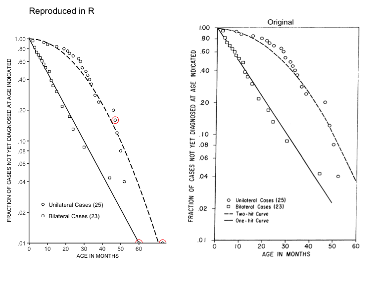

# Knudson


This package provides the data from Table 1 from [Knudson (1971)](https://doi.org/10.1073/pnas.68.4.820). This paper, entitled "Mutation and cancer: statistical study of retinoblastoma", provided the basis for the two-hit hypothesis of cancer. 

The two-hit hypothesis states that cancer arises via mutation of tumor supressor genes (TSGs), of which there are generally two genetic copies. Some patients are born with a mutation in one of the two copies of a TSG, which predisposes them to cancer.

The vignette also serves as a reproducibility case study that attempts to recreate Figure 1 using the data in Table 1 from Knudson (1971) (see below). 




* `k`: the data from Table 1 in this paper. This is a dataframe with 48 rows and 8 variables, described below:
    
    * `case`: the case number

    * `hosp_numb`: the hospital id number of the patient

    * `sex`: the sex of the patient

    * `age_at_dx`: the age (in months) of the patient at diagnosis

    * `r_tum`: the number of tumors in the right eye. * if unknown.
    
    * `l_tum`:  the number of tumors in the left eye. * if unknown.
     
    * `family_hx`: Is there a family history of retinoblastoma? If so, lists who was affected.
    
    * `side`: Was the retinoblastoma unilateral (unilat) or bilateral (bilat)
    
  
## Installation

```R
## Install the development version of knudson from github
devtools::install_github("dpique/knudson",
    build_opts=c("--no-resave-data", "--no-manual"),
    build_vignettes=TRUE)

library(knudson)

## open the vignette
vignette("knudson")
```
