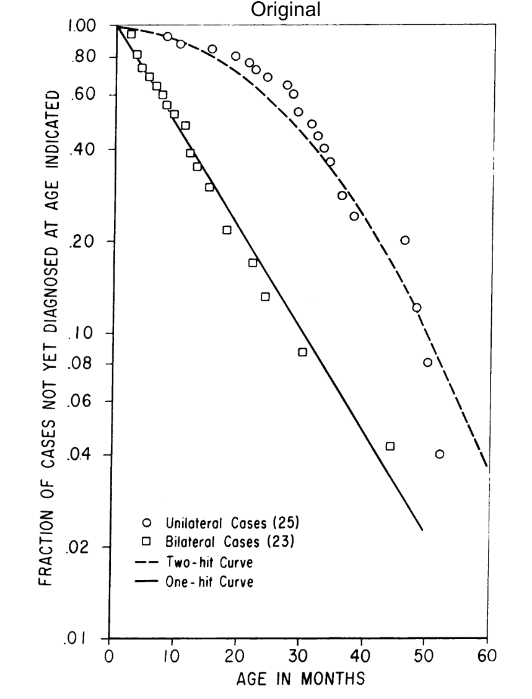

Knudson's ["Mutation and cancer: statistical study of retinoblastoma"](https://www.ncbi.nlm.nih.gov/pmc/articles/PMC389051/) (1971) forms the basis for the 2-hit hypothesis in cancer and has 8000+ citations in the biomedical literature. Here, I attempt to reproduce [Figure 1](https://www.ncbi.nlm.nih.gov/pmc/articles/PMC389051/?page=4) from this paper using the data provided in [Table 1](https://www.ncbi.nlm.nih.gov/pmc/articles/PMC389051/?page=2), which is also provided within this package as the object `k`. 

Let's take a look at figure 1 in knudson and compare it with the data in Table 1. The first thing I notice is that there are 2 patients in Table 1 who are diagnosed past age 60 months, though the x-axis in Figure 1 ends at 60 months.

```{r, echo = TRUE, out.width="50%"}
knud_fig1 <- 
knud_fig1
```


Hmm...interesting.


## Conclusion

This vignette highlights the importance of data reproducibility in the scientific literature.

We also notice that this paper was ['communicated'](https://www.pnas.org/content/106/37/15518) to PNAS, meaning that it was 'believed... (by a NAS member)... to be of sufficient significance to warrant publication.' This means that it did not undergo the standard rigorous process of peer review that generally involves 2-3 field experts.


```{r setup, include = FALSE}
knitr::opts_chunk$set(
  collapse = TRUE,
  comment = "#>"
)
```


## Load the `knudson` library and look at Table 1

```{r warning=FALSE, error=FALSE, message=FALSE}
library(knudson)
library(tidyverse)
library(patchwork)
library(png)

#k0 <- knudson::k %>% mutate(age_at_dx == ifelse(hosp_numb == 74616, 15, age_at_dx))
k[23,4] <- 15
data.frame(k) ## table 1
#k <- k1
#save(k, file = "../data/k.rda")
#saveRDS(k1,file = "k")

```


## Now, let's recreate figure 1 using the data from table 1

```{r, fig.height = 6, fig.width = 8}

k2 <- k %>%
  arrange(side, -age_at_dx) %>%
  group_by(side) %>%
  mutate(idx_sum = 1 / length(side), 
         prop_of_tot = cumsum(idx_sum) - idx_sum) %>%
  ungroup %>%
  mutate(side=factor(side, levels=c("unilat", "bilat"))) %>%
  group_by(side, age_at_dx) %>%
  filter(prop_of_tot == min(prop_of_tot))
         #prop_of_tot != 1)

k2_nofilt <- k %>%
  arrange(side, -age_at_dx) %>%
  group_by(side) %>%
  mutate(idx_sum = 1 / length(side), 
         prop_of_tot = cumsum(idx_sum) - idx_sum) %>%
  ungroup %>%
  mutate(side=factor(side, levels=c("unilat", "bilat"))) #%>%
  #group_by(side, age_at_dx) %>%
  #filter(prop_of_tot == min(prop_of_tot))


y_axis_seq <- c(0.01, seq(0.02, 0.1, 0.02), seq(0.2, 1, 0.2))
y_axis_seq_char = format(y_axis_seq, digits=2)

fig1 <- ggplot(k2, aes(x=age_at_dx, y = prop_of_tot, group=side, shape=side)) +
  geom_point() +
  scale_shape_manual(values=c(21,22), 
                     labels=c("Unilateral Cases (25)","Bilateral Cases (23)")) + 
  scale_y_log10(breaks = y_axis_seq, 
                limits = c(0.01, 1.04), 
                labels = as.character(gsub("^0\\.", "\\.", y_axis_seq_char)),
                expand = c(0, 0)) +
  scale_x_continuous(breaks = seq(0,60, 10), 
                     limits = c(-0.1, 75), 
                     expand = c(0, 0)) +
  xlab("AGE IN MONTHS") + 
  ylab("FRACTION OF CASES NOT YET DIAGNOSED AT AGE INDICATED") +
  theme_classic() + 
  theme(aspect.ratio = 1.5, 
        legend.position = c(0.3,0.16), 
        legend.title=element_blank()) +
  ggtitle("Reproduced in R")

knud_png <- png::readPNG("knudson_fig1_1971_PNAS.png")

knud_fig1_1 <- ggplot() +  
  annotation_custom(grid::rasterGrob(knud_png, 
                               width = unit(1,"npc"), 
                               height = unit(1,"npc")), 
                    -Inf, Inf, -Inf, Inf) #+ 
  #annotate("text", x = 1, y = 1, label = "Original")
fig1 + 
  knud_fig1_1 + 
  plot_layout(widths = c(1, 1.35))
```


## What happens when we compare this figure to the original figure?
We see that the original figure stops at age = 60. There are two datapoints that are >=60 and that are excluded from the original figure.

```{r, fig.height = 6, fig.width = 4}
fig1 + geom_rect(mapping = aes(xmin=0.1, xmax=60, ymin=0.01, ymax=1), fill=NA, color="red", linetype = 2)

```


We also notice that there is a datapoint missing where
```{r, fig.height = 6, fig.width = 4}

k2_missing <- k2 %>% filter(age_at_dx >= 60 | {age_at_dx == 48 & side == "unilat"})

fig1 + 
  geom_rect(mapping = aes(xmin=0.1, xmax=60, ymin=0.01, ymax=1), fill=NA, color="red", linetype = 2) + 
  geom_point(data = k2_missing, aes(x=age_at_dx, y = prop_of_tot), pch=21, fill=NA, color = "red", size=4)

```


We also produce a plot with each point annotated, and compare this to a manually annotated version of the original figure:
```{r fig.height = 6, fig.width = 8}
k3 <- k2 %>% 
  ungroup %>% 
  group_by(side) %>% 
  arrange(age_at_dx) %>% 
  mutate(idx = 1:n())

fig1_annot <- fig1 +
  geom_text(data=k3, aes(label = idx), size=3, nudge_x = 2) +   
  scale_x_continuous(breaks = seq(0,60, 10), 
                     limits = c(-0.1, 80), 
                     expand = c(0, 0))
  
knud_png_annot <- png::readPNG("knudson_fig1_1971_PNAS_annot.png")

knud_fig1_annot <- ggplot() +  
  annotation_custom(grid::rasterGrob(knud_png_annot, 
                               width = unit(1,"npc"), 
                               height = unit(1,"npc")), 
                    -Inf, Inf, -Inf, Inf)
fig1_annot + 
  knud_fig1_annot + 
  plot_layout(widths = c(1, 1.35))


```


## Next, we add in the statistical curves proposed by Knudson

```{r fig.height = 6, fig.width = 8}
fig1_bilat <- fig1 + geom_abline(intercept = 0, slope = -1/30, color="black", 
                 linetype="solid", size=0.5)

fig1_bilat + knud_fig1_1 + 
  plot_layout(widths = c(1, 1.5))


```


```{r eval=F}


+ # can set x limit to 50 here 
  stat_function(fun = function(t) -4 * 10^{-5} *t^2, linetype="longdash", color="red") + #raise to the 10^ power 

  stat_function(fun = function(t) -5 * 10^{-4} *t^2, linetype="longdash") + #raise to the 10^ power, incorrect from what's listed 
    stat_function(fun = function(t) -4 * 10^{-4} *t^2, linetype="longdash", color="green") + #raise to the 10^ power, incorrect from what's listed 
      stat_function(fun = function(t) -3 * 10^{-4} *t^2, linetype="longdash", color="blue") + #raise to the 10^ power, incorrect from what's listed 
      stat_function(fun = function(t) -3.5 * 10^{-4} *t^2, linetype="longdash", color="purple") + #raise to the 10^ power, incorrect from what's listed 

    stat_function(fun = function(t) 2.714^(-4*10^{-5} * t^2), linetype="longdash", color="green") + #raise to the 10^ power, try the log version 
  geom_hline(yintercept = .1) +

  


#calculate the best fit line

#add the two curves
logS = -t/30 # one hit curve
logS = -4 * 10^{-5} *t^2 #
logS = -5 * 10^{-4} * t^2 #-5 * 10^{-4} * t^2

```


We note two differences. The first is that the curve $logS = -5 \times 10^{-4}t^2$ is a better fit than the curve $logS = -4 * 10^{-5} *t^2$ reported in the paper, suggesting that these numbers may have been flipped. The second is that knudson reports the use of the natural logarithm, $ln S = -kt^2$, when in fact the graphic shows the use of $log_{10}$.


Below, we quantitate the goodness of fit from these different models.
```{r eval=F}

two_hit_fxn <- function(y){
  abs(log(y, 10)/(-4*10^(-4))) %>% sqrt
}

log(.2, 10) * -30

(log(.2, 10) / (-4*10^(-4)) ) %>% sqrt


f_log10_2 <- formula(prop_of_tot ~ I(10^(-age_at_dx*0.02607)))

f_log10_2 <- formula(log(prop_of_tot,10) ~ -age_at_dx/30)

#
f_log10_2 <- formula(prop_of_tot ~ I(10^(-age_at_dx/30)))# logS = -t/30 prop_of_tot ~ 10^-4 * 10^{-5} age_at_dx*^2))
optim_preds_knud <- predict.lm(object = f_log10_2, newdata = k2.bilat) # %>% {10^.}

preds <- model.frame(formula = f_log10_2, data = k2, subset = side == "bilat") %>% 
  as_tibble() %>% 
  mutate(resid = prop_of_tot - `I(10^(-age_at_dx/30))`) #`I(10^(-age_at_dx * 0.02607))`) #
hist(preds$resid)
rss <- sum(preds$resid^2)
rss #knudson's rss
rss2 <- sum(abs(preds$resid))
rss2


#now, we look at what an optimal rss would be
#optim_mod <- lm(formula = prop_of_tot ~ I(10^-(age_at_dx/30)), data = k2, subset = side == "bilat")
k2.bilat <- k2 %>% filter(side == "bilat")

#optim_mod <- lm(formula = I(log(prop_of_tot, 10)) ~ 0 + age_at_dx, data = k2, subset = side == "bilat")
#optim_mod2 <- lm(formula = k2.bilat$prop_of_tot ~ k2.bilat$age_at_dx), data = k2, subset = side == "bilat")

optim_mod <- lm(formula = prop_of_tot ~ log(age_at_dx,10), data = k2.bilat)


optim_mod_int_0 <- lm(formula = log(prop_of_tot,10) ~ age_at_dx + 0, data = k2.bilat)

sum(optim_mod_int_0$residuals^2) #sum of sq

optim_mod <- lm(formula = log(prop_of_tot,10) ~ age_at_dx, data = k2.bilat)
sum(optim_mod$residuals^2) #sum of sq

optim_mod <- lm(formula = prop_of_tot ~ age_at_dx, data = k2.bilat)


# now get the prediction from the model
optim_preds <- predict.lm(object = optim_mod, 
                          k2.bilat) #%>% {10^.}
                            #mutate(prop_of_tot = log(prop_of_tot,10)))  %>% {10^.}
# now get the observed from the data
k2.bilat$prop_of_tot

(optim_preds - k2.bilat$prop_of_tot)^2 %>% sum
#look up RSS on log scale

summary(residuals(optim_mod))
sum(optim_mod$residuals^2)


preds2 <- model.frame(formula = optim_mod, data = k2.bilat) %>%
  as_tibble() %>% 
  mutate(prop_of_tot_pred = optim_preds, #10^`log(prop_of_tot, 10)`,
         prop_of_tot_obs = k2.bilat$prop_of_tot,
         resids = prop_of_tot_pred - prop_of_tot_obs)
hist(preds2$resids)
rss <- sum(preds2$resids^2)
rss #knudson's rss

ggplot(preds2, aes(x=age_at_dx, y=prop_of_tot_obs)) + 
         geom_point() +
      # stat_function(fun = #optim_mod, 
      #               function(t) .76077 + -0.0723*t,
      #               linetype="longdash", color="purple") + 
        stat_function(fun = #optim_mod, 
                    function(t)  -0.02607*t,
                    linetype="longdash", color="blue") +
          stat_function(fun = #optim_mod, 
                    function(t) -1/30*t,
                    linetype="longdash", color="green") +
          stat_function(fun = 
                    function(t) 1.13 + -0.65177*t,
                    linetype="longdash", color="orange") +  

  scale_y_log10() #raise to the 10^ power, incorrect from what's listed 

hist(optim_mod$residuals)

sum(optim_mod$residuals^2)
optim_preds <- predict.lm(object = optim_mod, k2)#model.frame(formula = )

plot(formula = log(prop_of_tot, 10) ~ age_at_dx, data = k2)
predict(optim_mod, newdata = k2)


f_log10 <- formula(prop_of_tot ~ 10^-4 * 10^{-5} age_at_dx*^2))
model.frame(formula = f_log10, data = k2)
k2
logS = -4 * 10^{-5} *t^2 #
logS = -5 * 10^{-4} * t^2 #-5 * 10^{-4} * t^2

```


Create a test prediction with some synthetic data
see if I can predict the model

```{r}
```


